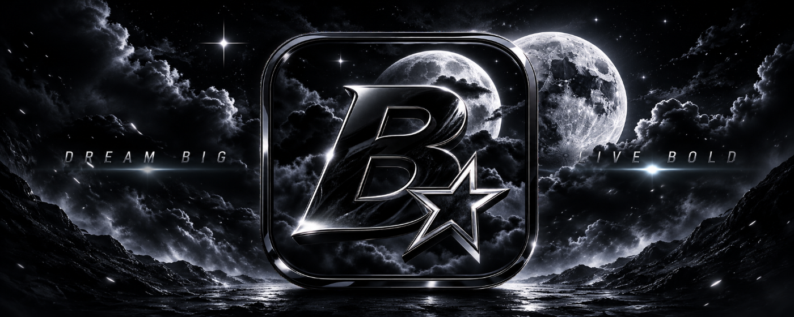

# 🌑 BlackNight Studios Launcher

<p align="center">
  
</p>

<p align="center">
  <strong>One launcher. Every BlackNight experience.</strong><br>
  <sub>Built and working — waiting on its first game.</sub>
</p>

<p align="center">
  <a href="#about">About</a> •
  <a href="#features">Features</a> •
  <a href="#games">Games</a> •
  <a href="#installation">Installation</a> •
  <a href="#development">Development</a> •
  <a href="#roadmap">Roadmap</a>
</p>

---

## 🌙 About

**BlackNight Studios Launcher** is the official custom game launcher developed for **BlackNight Studios**.

The launcher is the central hub for games created and published by BlackNight Studios: one application to discover, install, update, launch and manage them.

**Where this actually is today:** the launcher is built and works end to end — downloads with resume and retry, delta patching, LAN peer install, cloud saves, local accounts and passkeys, and a services backend. What it does *not* yet have is a game. The catalogue ships one free tech demo, and no title carries a download URL, so a packaged launcher currently has nothing to install. That is the honest state of it, and it is the next thing to change.

Built with a focus on **performance, simplicity, security, and atmosphere**, the launcher is designed to grow alongside the studio and its game library.

> **Enter the night. Discover what waits beyond it.**

---

## ✦ Features

### 🎮 Game Library
Browse and manage the complete collection of BlackNight Studios games from one place.

### ⚡ Fast Game Launching
Quickly launch installed games without unnecessary steps or additional software.

### 🔄 Automatic Updates
Keep games and launcher components up to date with automated update management.

### 📦 Game Installation
Install and manage BlackNight Studios titles directly through the launcher.

### 🌌 Custom BlackNight Experience
A fully branded launcher experience inspired by the studio's dark, cinematic, and cosmic identity.

### 🔐 Secure Infrastructure
Designed with secure communication and update delivery in mind to help protect players and studio content.

### 📢 News & Announcements
Stay up to date with new releases, patches, events, announcements, and studio news.

### 🛠️ Built to Expand
The launcher is designed as a foundation for future BlackNight Studios titles and services.

---

## 🎮 Games

The BlackNight Studios Launcher will serve as the central platform for our upcoming game releases.

| Game | Status | Availability |
|------|--------|--------------|
| **Coming Soon™** | 🛠️ In Development | Coming Soon |
| **More BlackNight Titles** | 🌑 Classified | Stay Tuned |

> New games will be added to the launcher as they are released.

---

## 🖥️ Supported Platforms

| Platform | Status |
|----------|--------|
| 🪟 Windows | ✅ Supported |
| 🍎 macOS | 🔜 Planned |
| 🐧 Linux | 🔜 Planned |

Platform availability may vary depending on individual game requirements.

---

## 📥 Installation

### Windows

1. Download the latest version of the BlackNight Studios Launcher.
2. Run the installer.
3. Follow the installation instructions.
4. Launch **BlackNight Studios Launcher**.
5. Sign in or create your BlackNight account.
6. Choose a game from your library.
7. Install and launch.

### Releases

Official launcher builds will be distributed through the project's **Releases** section.

---

## 🚀 Getting Started

Once installed, the launcher provides access to your BlackNight Studios game library.

```text
BlackNight Studios Launcher
│
├── 🏠 Home
│   ├── Featured Games
│   ├── News
│   └── Announcements
│
├── 🎮 Library
│   ├── Installed Games
│   ├── Available Games
│   └── Updates
│
├── 📥 Downloads
│   ├── Game Installation
│   ├── Updates
│   └── Download Queue
│
└── ⚙️ Settings
    ├── Account
    ├── Downloads
    ├── Game Locations
    └── Launcher Settings
